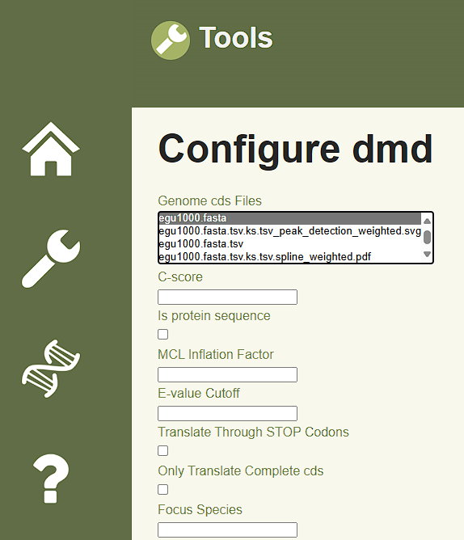

# Bio-informatics Toolbox

*2025-04-10 version 0.6.0a*

The purpose of this website is to simplify the tool [wgd v2](https://github.com/heche-psb/wgd), by 
making it accesible to users who may not have a background
in programming. Our goal is to provide an intuitive interface that
allows users to easily import FASTA files and receive a model in return.

Wgd stands for whole genome duplication, the tool can get DNA-sequences from a FASTA file. The
tool can eventually convert the sequence into a plot that shows when a wgd has occured. Comprising
seven sub-tools: *dmd, focus, ksd, mix, peak, syn and viz.* Because every sub-tool is extensive enough
to be a project itself. For this reason we focused on the sub-tool dmd. This tool can help with drawing 
conclusions from the sequences, such as determing orthological groups, and phylogeny.

## Installation

Installation instructions for the tool and website can be found below.

**Note: These instructions are for linux (specifically, debian).**

```sh
$ git clone git@github.com:Dunc4nNT/bit.git
```

### Tool

To install the commandline wgd tool, please follow the instructions below.

As we'll be using the bioconda package, we need conda (v25.1) with the bioconda channel added:

```sh
# replace the URL in wget with the version and OS you want from: https://repo.anaconda.com/miniconda/
$ mkdir -p ~/miniconda3
$ wget https://repo.anaconda.com/miniconda/Miniconda3-py39_25.1.1-2-Linux-x86_64.sh -O ~/miniconda3/miniconda.sh
$ bash ~/miniconda3/miniconda.sh -b -u -p ~/miniconda3
$ rm ~/miniconda3/miniconda.sh
$ source ~/miniconda3/bin/activate
$ conda init --all

# add the bioconda channels
$ conda config --add channels bioconda
$ conda config --add channels conda-forge
$ conda config --set channel_priority strict
```

To install wgd, create a conda environment for it with the provided `wgd_environment.yml` which includes all the required packages:

```sh
$ conda env create -f wgd_environment.yml
```

### Website

As we'll be using [uv](https://docs.astral.sh/uv/) (v0.6) as package manager for our project, please install this first.

```sh
$ curl -LsSf https://astral.sh/uv/install.sh | sh # latest

$ curl -LsSf https://astral.sh/uv/0.6.12/install.sh | sh # v0.6.12 (tested with this)
```

1. `uv sync` Creates a virtual environment, and installs all the packages.
2. `cp .env.example .env` Creates a `.env` file for a few configuration options.
3. Update the `SECRET_KEY` in the `.env` to be a random string.

#### Running flask

```sh
$ uv run flask run
```

#### Sass

**This is only required for development of the website, the compiled stylesheet is in the repo.**

First, we need nodejs (v23):

```sh
$ curl -o- https://fnm.vercel.app/install | bash
$ fnm install 23
```

Installing sass (and stylelint):

```sh
$ cd bit/static # from the project go to the static directory.
$ npm install # download all the packages.
```

Running the sass compiler:

```sh
$ cd bit/static
$ npx sass scss/main.scss css/main.css # compiles once.

$ npx sass --watch scss/main.scss css/main.css # compiles on save.
```

## Configuration

To change the directory in which uploaded, temp, and output files go, please edit `bit/dirpaths.py` to whichever path you want. These paths are relative.

```py
wgd_files_dir = "bit/static/wgd_files/" # directory in which the below mentions folders are found.
uploads_dir = wgd_files_dir + "uploads/" # directory in which files uploaded to the website get stored.
outdir = wgd_files_dir + "outdir/" # directory in which output files from wgd get stored.
tmpdir = wgd_files_dir + "tmpdir/" # directory in which temporary files from wgd get stored.
```

In `bit/app.py` the maximum upload size can be adjusted.

```py
app.config["MAX_CONTENT_LENGTH"] = 500 * 1024 * 1024 # size in bytes.
```

## Usage

Get clear graphs of your data based on your preferred configurable settings by submitting fasta formatted files containing genome coding DNA sequences.

<br>
Source: [WGD documentation](https://wgdv2.readthedocs.io/en/latest/recipes.html).

<br>
Source: [WGD documentation](https://wgdv2.readthedocs.io/en/latest/recipes.html).

### Example (num)

**Step 1:**

Upload the .fasta files and press submit. Or if you already have a .fasta file uploaded you can click Select tool.

<br>
*Source: [bit](https://github.com/Dunc4nNT/bit).*

**Step 2:**

Select the subtool you want to run and press submit. If the file you have chosen has not been run by dmd choose dmd. Otherwise you can choose ksd and skip to step 4.

<br>
*Source: [bit](https://github.com/Dunc4nNT/bit).*

Now select the .fasta file you uploaded, check some aditional options and press submit

<br>
*Source: [bit](https://github.com/Dunc4nNT/bit).*

**Step 3:**

Next, go back to the tool page and press Select tool.

Here you select ksd and press submit.

<br>
*Source: [bit](https://github.com/Dunc4nNT/bit).*

**Step 4:**

In this form in the first and second bar you are asked to select the files.

Inside the first one you want to select the .fasta.tsv file and in the second the .fasta file.

<br>
*Source: [bit](https://github.com/Dunc4nNT/bit).*

Now it should give you the {filename}.fasta.tsv.ks.tsv on screen. If not try again from step 1.

<br>
*Source: [bit](https://github.com/Dunc4nNT/bit).*

**Step 5:**

Now go back to the tool page and press Select tool. Then select viz and press submit.

<br>
*Source: [bit](https://github.com/Dunc4nNT/bit).*

**Step 6:**

On this form page you select the created `<filename>.fasta.tsv.ks.tsv` file. Select and/or fill in any additional options and press submit.

<br>
*Source: [bit](https://github.com/Dunc4nNT/bit).*

Now you should see your graphs.

<br>
*Source: [bit](https://github.com/Dunc4nNT/bit).*

<br>
*Source: [bit](https://github.com/Dunc4nNT/bit).*

## Contact

For bug reports please use [github issues](https://github.com/Dunc4nNT/bit/issues).

For questions about the app, please use [github discussions](https://github.com/Dunc4nNT/bit/discussions).

## References

1. Chen, A. Zwaenepoel, and Y. Van De Peer, “wgd v2: 
a suite of tools to uncover and date ancient polyploidy and 
whole-genome duplication,” Bioinformatics, vol. 40, no. 5, Apr. 2024, 
doi: 10.1093/bioinformatics/btae272.

## Authors

[Duncan](https://github.com/Dunc4nNT)

[Sven](https://github.com/svenstaats)

[Johanna](https://github.com/j0w0j)

[Tarnished-06](https://github.com/Tarnished-06)
